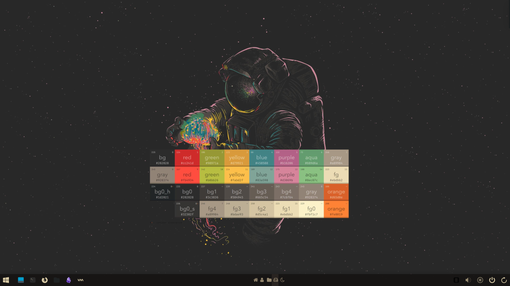
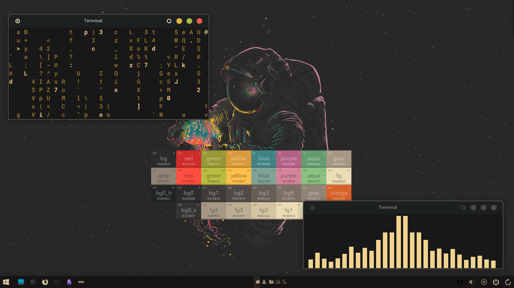
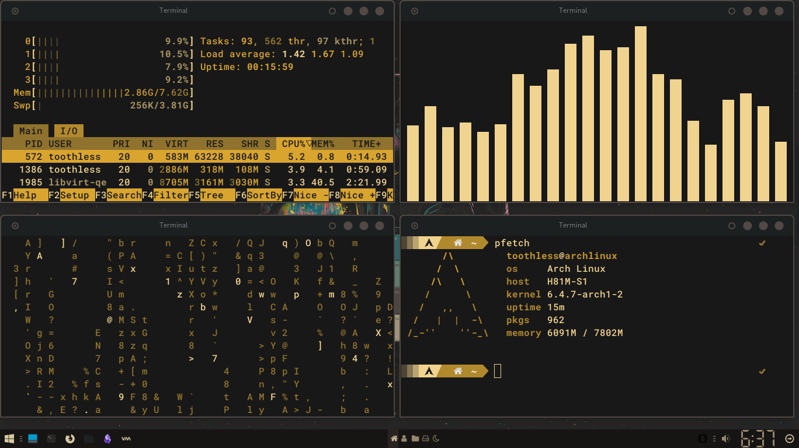

### Screenshots:

 

 

### Installation:
The following instructions will guide you through the installation of my current Arch Xfce rice on Debian or any other Xfce environment. Please make sure to configure the rice according to your own needs.

1. First download `xfce4` & `xfce4-goodies`.
2. Download the archive file [dotfiles.tar](https://mega.nz/file/3EMnUBhZ#keXOrmTesk7oUJ1DjA0gAL02WMu9_L5dSg7RNZJKt_Y).
3. Unzip the file.
4. Place the contents of the archive file in the appropriate directories.
5. Make any necessary changes to the configuration files.
6. Use the `lxappearance` tool to import the `cursor.tar.gz` file and select it as cursor theme.

### Color Scheme:
The color scheme for this rice was generated using the `pywal` utility. A short tutorial on how to generate the same color scheme can be found in the `.cache/wal` directory.

### Panel and Tiling:
A panel has been added to the right side of the screen for window buttons. Xfce's tiling feature has also been enabled. Please adjust the keybinds to your liking.

### System Information:
- Operating System: Arch
- Desktop Environment: Xfce4
- Theme: Gruvbox
- Panel: Xfce4-panel
- Terminal: Xfce4-terminal-emulator
- Firefox Theme: Gruvbox
- Screen Resolution: 1366x768
- Display Manager: SDDM With sugar dark theme
- File Manager: Thunar
  
I hope you enjoy using this rice!
